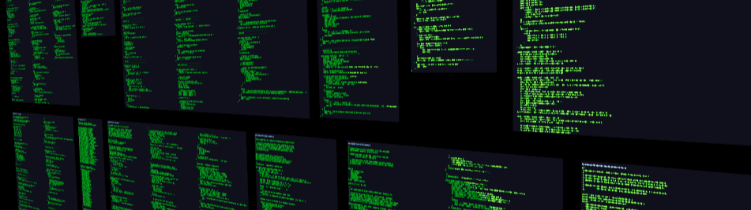
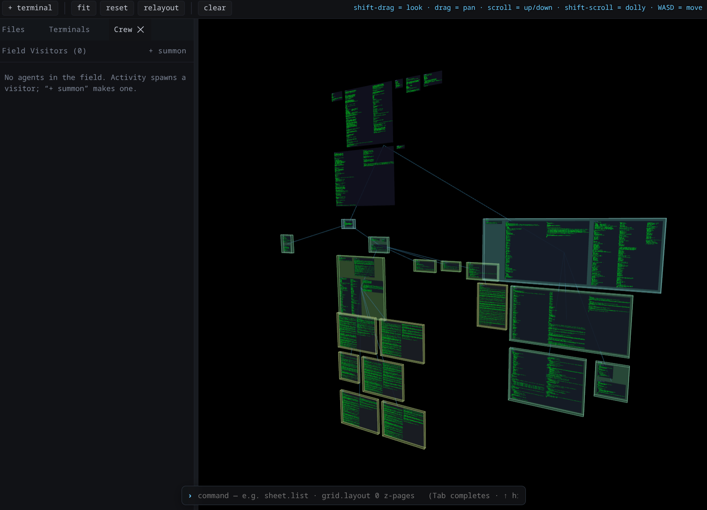

# glyph3d-js

High-performance **3D text and code rendering** for [Three.js](https://threejs.org/),
using GPU-instanced glyphs on a WebGPU renderer. Thousands of glyphs in a single
draw call — built for navigating source code, directory trees, and live terminals
in 3D space.

<p align="center">
  
  <br>
  <em>Whole source files as GPU-instanced glyphs in 3D — thousands of glyphs, one draw call.</em>
</p>

> Status: `v0.2.0`, pre-release. The core library API is still settling.

## What's in here

This is a monorepo organized as **a package, an app, and a cli**:

| | Path | What it is |
|---|---|---|
| **Package** | `packages/glyph3d-core` | [`@glyph3d/core`](packages/glyph3d-core) — the renderer + glyph shaping + layout + code/terminal grids. The publishable library. |
| | `packages/glyph3d-r3f` | [`@glyph3d/r3f`](packages/glyph3d-r3f) — react-three-fiber bindings for the core. |
| **App** | `app/` | A react-three-fiber IDE that consumes the package — file tree + 3D code grids + terminals, driven by a command bus. |
| **CLI** | `cli/` | A Go single binary: bakes in the built app and serves it alongside a WebSocket relay, sandboxed filesystem RPC, tmux-backed terminal adapters, relay-hosted language servers, and a queryable log store. |

## Features

- **GPU-instanced rendering** — each grid of text is one `InstancedBufferGeometry`
  draw call, sized to its content; instance buffers grow on demand.
- **WebGPU / TSL** — renders through `three/webgpu` with Three.js Shading Language
  NodeMaterials (no GLSL). One shared material per grid kind, not one per grid.
- **Vector glyphs** — HarfBuzz shaping + Slug GPU bezier coverage: analytic
  antialiasing, crisp at any scale. A prebaked glyph core ships as a static asset
  and hydrates at boot; new glyphs encode incrementally. Font fallback chain and
  a growable color-emoji atlas with double-width cells.
- **Real-metric layout** — the monospace cell derives from font extents; every
  dimension comes from the shaper at runtime, never a hardcoded constant.
- **CodeGrid** — a source file as a navigable 3D object: windowed/framed layouts,
  in-place editing with a codepoint-consistent cursor, highlight ranges, and a
  caret overlay.
- **TerminalGrid** — live tmux-backed terminals as first-class 3D objects: full
  ANSI color including per-cell backgrounds, scrollback paged into depth,
  grip-resize, and keyboard capture.
- **ContentTree** — a directory-mirroring scene graph with pluggable layout
  schemes (`packed`, `walk`, `district`, `jellyfish`, `tree`), so the field
  reads as the project's shape.
- **Semantic structure** — tree-sitter syntax coloring and an AST-backed
  semantic model drive structural layouts (callable units as movable
  sub-blocks, nested strata) and navigation.
- **GPU picking** — a multi-channel ID render pass is the single source of
  truth for hover and click, down to the individual glyph.
- **Command bus** — every action is a verb; UI clicks, the keyboard, and the
  CLI hit the same handlers.
- **Web Worker parallelization** — instance buffers build off the main thread.

## Install (library)

```bash
bun add @glyph3d/core three
# three is a peer dependency

bun add @glyph3d/r3f      # react-three-fiber bindings, if you're on React
```

The renderer targets WebGPU, so use `three/webgpu`. For a complete, working
consumer of the library, see the **`app/`** project (a react-three-fiber client).
The package's entry points:

```javascript
import { ... } from '@glyph3d/core';               // main entry
import { ... } from '@glyph3d/core/collections';    // CodeGrid, TerminalGrid, ContentTree, layouts
import { ... } from '@glyph3d/core/workers';        // WorkerBridge
import { ... } from '@glyph3d/core/shaping';         // HarfBuzz + Slug shaping
import { ... } from '@glyph3d/core/services/...';    // interaction, camera, data, orchestration, …
```

(See `packages/glyph3d-core/package.json` for the full `exports` map.)

## Run the app (single binary)

```bash
make build                       # build the app + bake it into the binary (~27M)
./glyph3d-cli serve ~/your-project
# open http://localhost:8080/
```

The binary is self-contained — it serves the built IDE and runs the relay,
filesystem RPC, terminal adapters, and language servers for a single operator
(no auth; designed for personal/dev use). Sessions persist server-side: your
files, camera, dock, and terminals come back after a reload.

<p align="center">
  
  <br>
  <em>The bundled IDE — a navigable 3D field of code grids and terminals, all on the core renderer.</em>
</p>

### Drive it from the CLI

The binary speaks the same command bus as the UI — any verb, from the shell:

```bash
./glyph3d-cli grid.list                  # what's in the field
./glyph3d-cli file.open src/main.js      # open a file into 3D
./glyph3d-cli layout.scheme jellyfish    # repack the whole field
./glyph3d-cli log.errors                 # query the relay-side log store
```

Global flags go *before* the subcommand (e.g. `--port 8099 grid.list`), and
`glyph3d-cli help` lists the verb map.

## Development

```bash
git clone https://github.com/tikimcfee/glyph3d-js.git
cd glyph3d-js
bun install
tools/dev.sh        # Vite dev server (:5173) + Go relay (:8080)
```

Open `http://localhost:5173` (hard-reload after a Vite restart). See
[CONTRIBUTING.md](CONTRIBUTING.md) for the full dev loop, build, and conventions.

## Performance

The performance story is structural rather than a fast path:

- **One draw call per grid** — text becomes a single `Float32Array` of per-glyph
  instance attributes and renders as one instanced draw; renderers are sized to
  their content and grow on demand.
- **Shared materials** — one TSL NodeMaterial per grid kind, so a
  thousand-grid scene doesn't become a thousand shader programs.
- **Prebaked glyph core** — the Slug bezier encoding for the common glyph set
  is baked headlessly and served as a static asset; boot hydrates it instead of
  re-encoding, and new glyphs append incrementally.
- **Work scales with what you see** — frustum culling adds and removes grids
  from the scene, distance LOD thins far fields, and grid reloads are budgeted
  per frame so a camera move can't stampede the main thread.
- **Workers** — instance buffers build off the main thread.

In practice the ceiling is grid count (GPU objects), not glyph count: whole
repositories load as hundreds of complete, editable files, and the measured
falloff starts in the thousands-of-grids regime. `tools/loadcurve.mjs` is the
stress rig we use to push on that boundary.

## Browser support

Requires **WebGPU**. Works in current Chrome / Edge / Vivaldi. On Linux, plain
Firefox may crash on WebGPU — prefer a Chromium-based browser or a
properly-configured Firefox.

## Contributing

See [CONTRIBUTING.md](CONTRIBUTING.md).

## License

MIT — see [LICENSE](LICENSE).

## Credits

glyph3d-js grew out of [SwiftGlyph](https://github.com/tikimcfee/SwiftGlyph) —
the same idea, native on Apple platforms — and the need for high-performance
text rendering in web-based code visualization tools.
